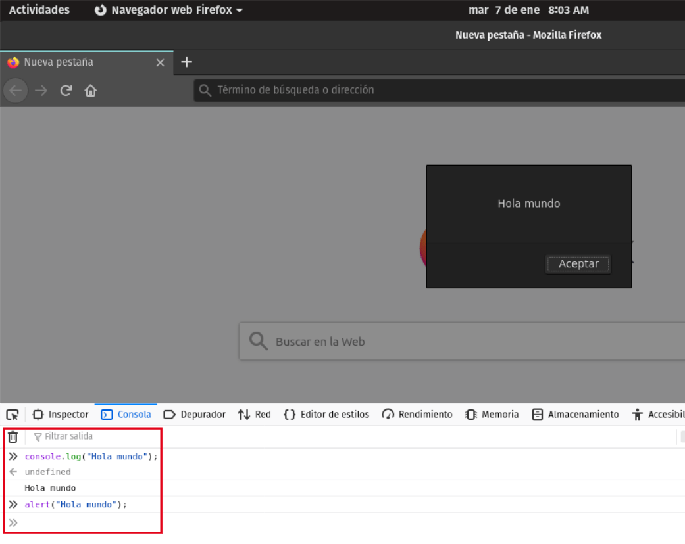
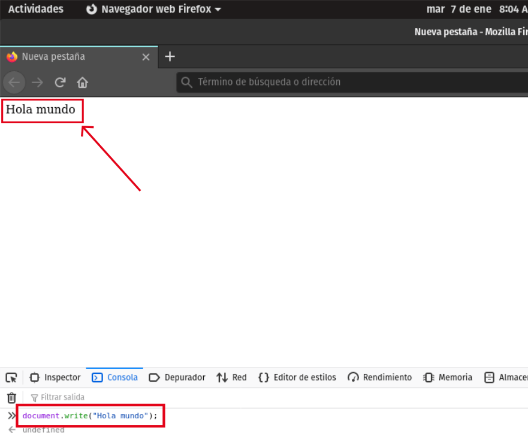
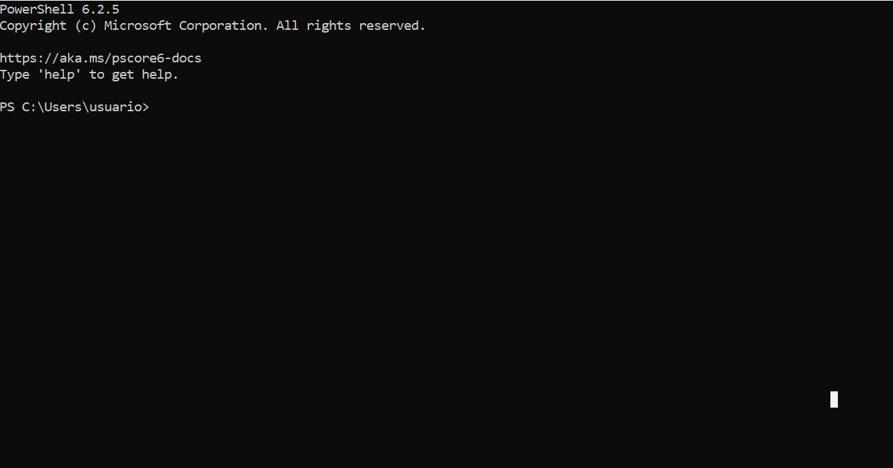

# Algunos ejemplos de “Hola Mundo” 👀

## JavaScript 🟡

Antes que nada, si no conoces este lenguaje, te dejo este link: [https://dev.to/vanessamarely/que-es-javascript-1cbg](https://dev.to/vanessamarely/que-es-javascript-1cbg) de: [https://dev.to/vanessamarely](https://dev.to/vanessamarely) donde explica de manera clara, con una mini intro, qué es JavaScript.   
Cuando lo termines de leer, ven de nuevo acá, para presentarte las 3 formas que conozco de crear un "Hola Mundo" en este lenguaje. Te espero. 😊


Ahora que has regresado, te muestro esas 3 formas que mencionaba.  
   
**1. console.log**

```text
console.log("Hola Mundo");
```

**2. alert** 

```text
alert("Hola Mundo");
```

**3. document.write**

```text
document.write("Hola Mundo");
```

Todos son métodos en JavaScript, que permitirán crear y ver el "Hola Mundo", ya sea introduciendo JavaScript en un archivo .html o en la terminal del navegador que usamos. _**Más adelante te explico qué es esa terminal .**_

Sólo hay una pequeña diferencia entre los 3. Con **console.log** se verá en consola el mensaje, con **alert** va salir una ventana de alerta con el mensaje, que no se quita hasta que se le de al botón de aceptar que tiene y finalmente, **document.write** hace que aparezca el mensaje en el documento del navegador. 

Aquí la muestra de cómo se vería con **console.log** y **alert**: 



Y con **document.write**:




## **¿Qué es la terminal del navegador?** 💻

Resulta que en mi navegador web \(sea Google Chrome, Firefox...\), al darle clic derecho sobre cualquier parte de la ventana en la que estás ubicad@, aparecerán varias opciones, entre esas, **Inspeccionar**. Luego, al lado derecho, saldrá la opción de **Console**, en donde puedes hacer ejercicios de prueba, entre esos, el de "Hola Mundo".

Te invito a que juegues con la terminal de tu navegador. Experimenta y aprende. 🧐🦾


## **Python** 🔵🟡

### ¿Qué es?

En pocas palabras, Python es un lenguaje de programación de alto nivel. Alto nivel significa que es capaz de expresar los algoritmos \(las operaciones que permiten la solución de un problema\) de una manera que se ajusta a la capacidad cognitiva humana y no tanto al de una máquina.   
Si quieres saber más de qué trata este lenguaje te dejo este link: [https://medium.com/@cleverpysolutions/tutorial-de-introducci%C3%B3n-a-python-3b722150001d](https://medium.com/@cleverpysolutions/tutorial-de-introducci%C3%B3n-a-python-3b722150001d) que te va introducir a Python y no sólo eso, sino también al tema que tratamos, el "Hola Mundo". Por tanto, encontrarás una explicación para crear tu primer programa \(**"Hola Mundo"**\) en Python. 


En Python hay un método que permite crear y visualizar el "Hola Mundo" y ese es **print**, el cual podemos hacer en la terminal local \(de tu computador\) que sea de tu preferencia. En mi caso utilicé una que se llama PowerShell, verificando antes sí tenía instalado Python y luego haciendo el ejercicio, que da como resultado algo así: 



Hasta aquí hemos llegado con algunos ejemplos, que espero te sean de mucha utilidad y con los que hayas aprendido, para luego llevarlos también a la práctica si lo deseas. Nos vemos ahora con Node.js. Hasta pronto.😁👇


