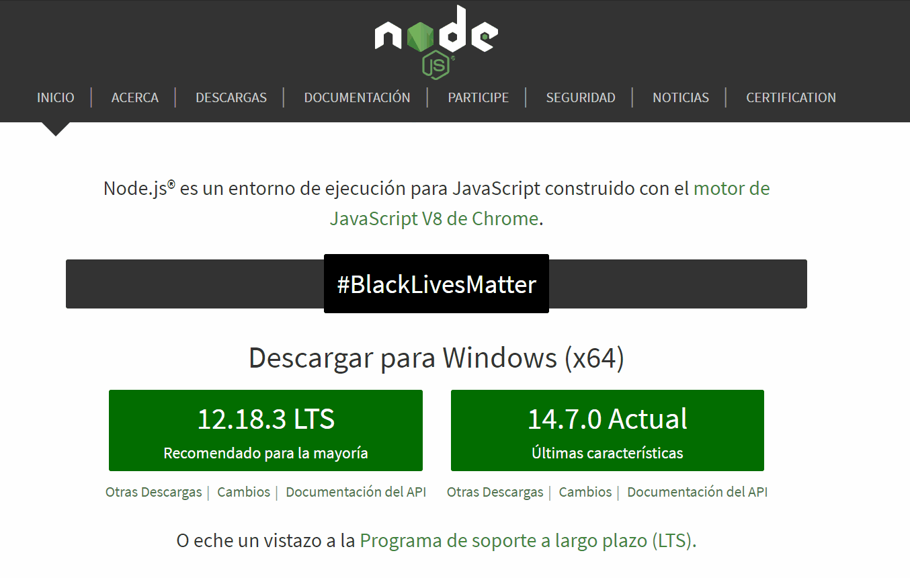
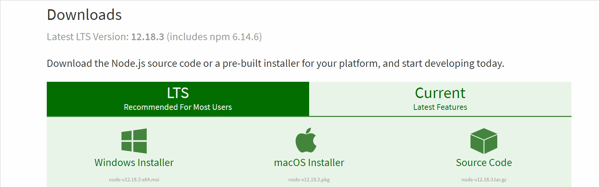
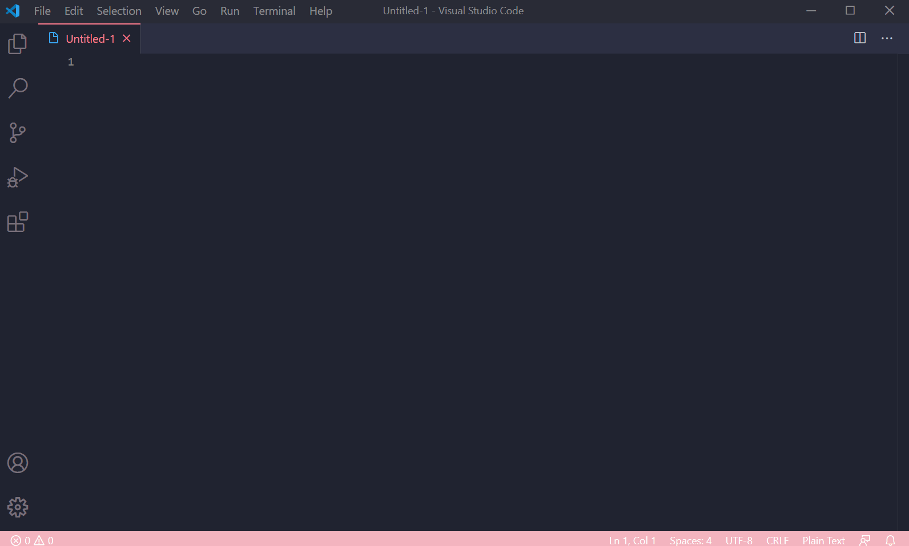
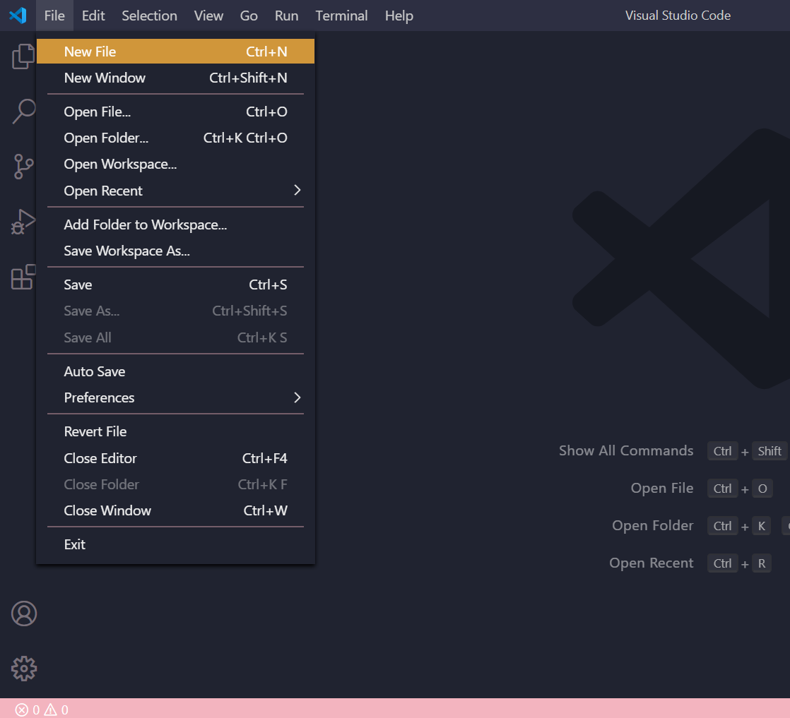
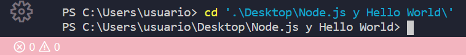
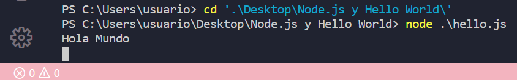
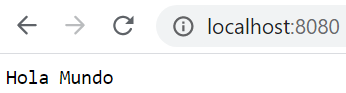

# Nuestro primer “Hola Mundo” en Node.js 💪👩‍💻👋🌎

## HERRAMIENTAS🔧⚙

### 1. Node.js

_**En Windows y Ubuntu**_

* Se hace la descarga en la página oficial: [https://nodejs.org/es/](https://nodejs.org/es/)



_**Nota:**_ La versión más reciente puede tener fallos, justamente porque es muy nueva, para evitar inconvenientes, es recomendable por tanto escoger la versión más estable \(La que se puede ver a la izquierda\)

#### _En Mac_ 

* En Mac se instala Node.js también desde la página oficial, pero en donde dice MacOS Installer: [https://nodejs.org/en/download/](https://nodejs.org/en/download/)




* Tras terminar el proceso verificamos que está correctamente instalado, podemos comprobarlo con dos comandos en nuestra terminal de preferencia, hasta puede ser la terminal del editor de texto \(como Visual Studio Code\):

```text
node --version
```

```text
npm --version
```

### 2. Un editor de texto: Visual Studio Code 

Este es un editor de texto donde trabajaremos, el cual se puede descargar aquí: [https://code.visualstudio.com/](https://code.visualstudio.com/)

### 3. Una terminal

Puede ser la de tu preferencia, en Windows cmder es una opción: [https://cmder.net/](https://cmder.net/), mac iterm: [https://www.iterm2.com/](https://www.iterm2.com/) y linux terminator: [https://terminator-gtk3.readthedocs.io/en/latest/](https://terminator-gtk3.readthedocs.io/en/latest/)

Incluso se puede usar la de Visual Studio Code: 



### 4. Git 

Este es un software de control de versiones, que nos permite hacer los cambios en GitHub. Su descarga se puede hacer aquí: [https://git-scm.com/downloads](https://git-scm.com/downloads)


### 5. GitHub

Nos permite llevar un registro y control de nuestro código, será muy útil a la hora de administrar nuestro código y crear un repositorio con nuestro ejercicio. 

Recomiendo este artículo de [https://github.com/vanessamarely](https://github.com/vanessamarely), donde está el paso a paso para la crear de nuestra cuenta y repositorio: [https://ngchallenges.gitbook.io/project/guias-utiles/github](https://ngchallenges.gitbook.io/project/guias-utiles/github)


Ahora que nuestras herramientas están listas, manos a la obra. 🤗


## EJERCICIO \(¡Manos a la obra! 👩‍💻\)

### Paso 1: En VSCode crear un nuevo archivo .js 📄

Abriremos nuestro editor de texto \(**Visual Studio Code**\) y creamos un nuevo archivo \(**File** 👉 **New** **File** o **Ctrl + N**\) al cual le pondremos como nombre **hello.js** \(También puede ser el nombre que desees con tal de que quede el archivo termine con **.js**, ya que Node corre con JavaScript\) y lo guardaremos en alguna carpeta, también puede ser en el escritorio de tu computador. La idea de guardarlo en una carpeta es para que sepas dónde está tu ejercicio y no se te pierda. 




### Paso 2: Comprobar que Node esté instalado 🧐

Recuerda que se pone en la terminal el siguiente comando: 

```text
node --version
```

### 

### Paso 3: Utilizar require y pasar la librería o módulo que se quiere importar 💻

Node está separado en diferentes librerías o módulos, que se importan al script del servidor utilizando **require**, el cual ****se pone cuando se **requiere** un módulo.   
Escribimos entonces **require** y el nombre del módulo, que sería **http** y que guardaremos en una variable, que en este caso se llama también **http.**

**Http** es un módulo que se va encargar de servir a aplicaciones web. En otras palabras, las aplicaciones se comunican a través del navegador con **http**.

Lo anterior quedaría así:



```javascript
var http = require("http"); 
```



### 

### Paso 4: Agregar método createServer 💥

La variable **http** va permitir crear el servidor mediante el método **.createServer\(\)**, que es una función que recibirá como parámetro otra función \(**Callback**\) llamada **manejador**.



```javascript
var http = require("http"); 

var manejador = function() { 
   
};

http.createServer(manejador); 
```




### Paso 5: Agregar parámetros a la función y nuestro "Hola Mundo" 🤩

La función recibe dos argumentos o parámetros, uno es el objeto con la información de la solicitud que hace el usuario y el otro con la respuesta al usuario, como parámetros se pueden poner los nombres que se quieran. Pero en este caso le pondremos **solicitud** y **respuesta**.



```javascript
var http = require("http"); 

var manejador = function(solicitud, respuesta) { 
   
};

http.createServer(manejador); 
```



La función se ejecutará cada vez que el navegador hace una petición a nuestro servidor con Node. Escribiremos entonces nuestro tan esperado **"Hola Mundo"** utilizando **console.log**, de la siguiente manera: 



```javascript
var http = require("http"); 

var manejador = function(solicitud, respuesta) { 
   console.log("Hola Mundo");
};

http.createServer(manejador); 
```



Pero aquí no para la cosa, es necesario que nuestro servidor funcione y para eso, le decimos en qué puerto va ser escuchado. Vamos al próximo paso. 👇


### Paso 6: Indicar el puerto donde se va ejecutar el servidor 👂

Vamos a guardar el **http.createServer** en una variable llamada **servidor**. Ese **servidor** va tener un método **listen**, que lo coloca dentro de la red, listo para hacer peticiones al **servidor**. Se le manda al método como parámetro en qué puerto queremos que se escuche. Lo recomendable es que para no generar conflictos con otras aplicaciones, lo coloquemos en el **puerto 8080**. 



```javascript
var http = require("http"); 

var manejador = function(solicitud, respuesta) { 
   console.log("Hola Mundo");
};

var servidor = http.createServer(manejador); 

servidor.listen(8080);
```



Ponemos en nuestro navegador localhost: 8080, pero debemos antes ejecutar el archivo. Para eso, desde la terminal con el comando **cd** nos paramos en la carpeta donde tengamos el archivo **hello.js**, así: 



Ya para ejecutar nuestro archivo de Node colocamos en la terminal node y el nombre de nuestro archivo:

```text
node .\hello.js
```

Lo siguiente que pasará es que quedará en espera y parecerá que nada ha pasado, eso es porque el servidor se está ejecutando y está esperando recibir peticiones de un navegador. Por tanto, cuando actualizo mi página \(**localhost:8080\)** en nuestra terminal aparecerá nuestro primer **"Hola Mundo"** en **Node.js** 😁



Nuestra página se queda cargando porque nuestro servidor no responde al navegador. Vamos al último paso. 🤗👇


### Paso 7: Cerrar conexión y mandar "Hola Mundo" al navegador 🤩

Para que el navegador sepa que ya termino de extraer toda la página, tiene que cerrar la conexión en Node, que se hace con el parámetro de **respuesta** y el método **end**, luego le doy a la terminal **Ctrl + c** para cerrar el servidor. 



```javascript
var http = require("http"); 

var manejador = function(solicitud, respuesta) { 
   console.log("Hola Mundo");
   respuesta.end();
};

var servidor = http.createServer(manejador); 

servidor.listen(8080);
```



_**Nota:**_ Ejecuto de nuevo:

```text
node .\hello.js
```

Si vemos que al recargar la página se pone dos veces **"Hola Mundo"** es porque uno es por la petición por la página y otra para el favicon que puede aparecer \(icono\). 

🌟 **Lo esperado** 🌟

Continuando y llegando al paso tan esperado, mandaremos en **respuesta.end** nuestro **"Hola Mundo"** y en **console.log** la cadena con **"Recibimos una nueva petición"**. 



```javascript
var http = require("http"); 

var manejador = function(solicitud, respuesta) { 
    console.log("Recibimos una nueva petición"); 
    respuesta.end("Hola Mundo");
};

var servidor = http.createServer(manejador); 

servidor.listen(8080);
```



Reiniciamos en la terminal, cargamos nuestra página y **¡Voilà!** 😍



**¡Nuestro primer "Hola Mundo" en Node.js!** 🌟😍💪🥳


  
Sé que ha sido un proceso largo, pero lo logramos, espero hayas aprendido muchísimo y termines con una gran motivación para seguir por tu cuenta, queriendo realizar tus propios ejercicios y proyectos. Que este conocimiento que has adquirido lo quieras compartir con otr@s. Siéntete segur@ de ti mism@, es un gran paso. 💪

Lo que ahora es montar nuestro ejercicio en nuestra cuenta de GitHub: [https://ngchallenges.gitbook.io/project/guias-utiles/github](https://ngchallenges.gitbook.io/project/guias-utiles/github)


