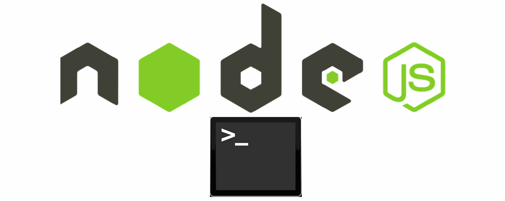
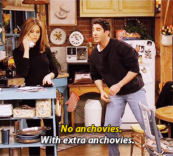

# ¿Qué es Node.js? 🟢

Node.js es una plataforma para el desarrollo de aplicaciones web utilizando JavaScript desde el servidor, es decir que responde a la petición que el navegador haya hecho \([**Backend**](https://rafarjonilla.com/que-es/backend/#:~:text=El%20backend%20es%20la%20parte,la%20comunicaci%C3%B3n%20con%20el%20servidor.)\)

Es decir, Node.js brinda herramientas a los servidores, de ese lado. También popular en el desarrollo de API's \(Interfaz de Programación de Aplicaciones\). De código abierto. Controlado por eventos \(pero no los eventos que se conocen en JavaScript, ahí se utilizan del lado del cliente y acá es del lado del servidor\), lo cual lo hace asíncrono \(Significa cuando más de una cosa ocurre al mismo tiempo\).

_**Nota:**_  Es necesario saber que Node.js viene con un gestor de paquetes por defecto, el cual se llama **npm** \(**Node Package Manager**\). En otras palabras, gracias a **npm** podemos instalar, gestionar y actualizar librerías de manera sencilla**.**  Por ejemplo, **npm** usa un fichero especial llamado **package.json** en el que se declaran las librerías y sus versiones.

### ¿Qué es síncrono y en qué se diferencia de lo asíncrono? ⏳

Podemos entender la programación síncrona con el siguiente ejemplo: supongamos que llamamos a un restaurante y le pedimos al cocinero o a la cocinera \(que sería el programa 👩‍🍳\), una orden de pizza con una guarnición de papas fritas. 🍕🍟  
Cuando le pedimos al programa \(cocinero/a 👩‍🍳\) que haga esa acción que tarde mucho, llega a ese momento, ejecuta la orden de pizza, pero espera hasta que termine esa acción para pasar a hacer las papas fritas. 🍕⏳🍟

A diferencia de la programación asíncrona, no espera terminar la pizza para luego continuar con las papas fritas, sino, que mientras el/la cocinero/a prepara la pizza, ejecuta otras cosas \(las papas fritas\). ¿Esto con qué fin? De que le rinda y vaya mucho más rápido para que como clientes, podamos tener nuestra orden lista lo más pronto. ⚡

Ahora, vamos a descubrir las ventajas de Node.js 👇💪

